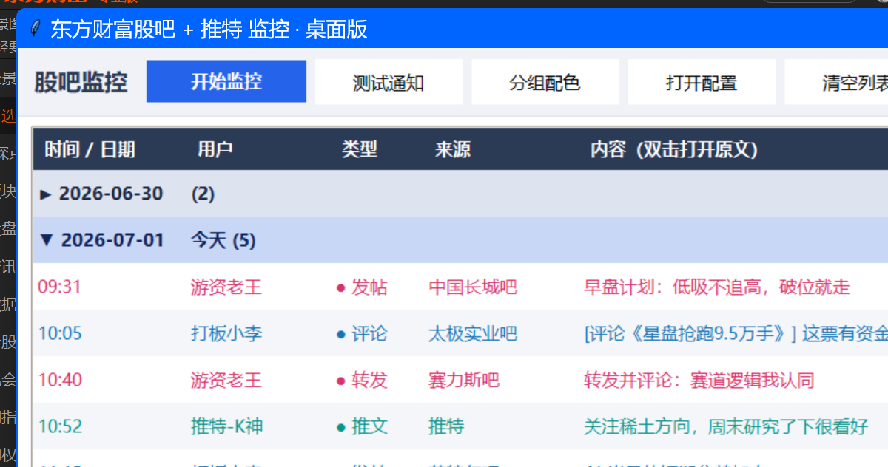

# 股吧 & 推特 监控（东方财富股吧 + X）

一个本地运行的桌面小工具：盯住你关心的**东方财富股吧用户**和**推特(X)用户**，
他们一发帖 / 评论 / 发推，就弹 **Windows 系统通知** 并显示在窗口列表里。
**不依赖任何第三方推送服务、没有每日条数上限。**



## ✨ 功能

- **股吧**：监控指定用户的 发帖 / 文章 / 转发 / 在别人帖子下的**评论**
- **推特(X)**：监控指定用户的新推文（需 `twitter-cli` + X 账号 Cookie）
- **Windows 系统通知** + 窗口列表，双击任意一行用浏览器打开原文
- 列表**按日期分组**、过去日期自动折叠；**用户分组配色**（内置 8 个中国传统色）
- **静音**：可把某些用户设为"只收进列表、不弹通知"
- 也可选择**推送到微信**（Server酱 / PushPlus）
- 纯本地运行；仅需 Python 标准库 +（可选）`winotify`

> ⏱ 「准实时」轮询：每隔一段时间抓一次，发现新内容就提醒，延迟约等于轮询间隔。

---

## 一、准备工作（只需做一次）

### 1. 拿到要监控用户的 UID

1. 打开 [东方财富股吧](https://guba.eastmoney.com)，找到你想监控的人，点进他的主页。
2. 看浏览器地址栏，形如 `https://i.eastmoney.com/5591057086910116`，
   其中 **`5591057086910116` 就是这个用户的 UID**。
3. 把每个要监控用户的 UID 记下来。

### 2.（仅微信推送版需要）申请推送 Key

> 用桌面应用版可**跳过这步**。只有想推到微信时才需要。

- **Server酱**：打开 https://sct.ftqq.com 微信扫码登录，复制 SendKey（形如 `SCT123…`），按提示关注公众号。
- **PushPlus**：打开 https://www.pushplus.plus 微信登录，复制 token。

### 3. 填写配置文件 `config.json`

> 首次使用：把仓库里的 `config.example.json` **复制一份改名为 `config.json`**，再按下面修改。
> （`config.json` 含密钥/隐私，已被 git 忽略、不会进版本库。）

```json
{
  "poll_interval_seconds": 60,
  "monitor_posts": true,
  "monitor_replies": true,
  "push": {
    "type": "serverchan",
    "key": "把你的 SendKey 或 token 粘到这里"
  },
  "users": [
    { "uid": "5591057086910116", "name": "张三" },
    { "uid": "1234567890123456", "name": "李四" }
  ]
}
```

- `poll_interval_seconds`：每轮检查的间隔秒数。监控人少可以设小（30~60）；想更省事就 60~120。
- `monitor_posts`：是否监控**发帖/文章/转发**（`true` 开 / `false` 关）。
- `monitor_replies`：是否监控**评论/回复**（`true` 开 / `false` 关）。
  > 评论很活跃的大V（比如直播贴里一直刷评论）会推得很频繁，嫌吵可以把这项设为 `false`。
- `push.type`：用 Server酱 填 `"serverchan"`；用 PushPlus 填 `"pushplus"`。
- `push.key`：上一步拿到的 SendKey 或 token。
- `users`：要监控的人，`uid` 必填，`name` 是你自己起的备注名（推送里会显示）。

### 用户分组 & 配色

**最简单：** 在应用里点工具栏 **「用户设置」** 按钮：
- 每个用户给出 8 个 **中国传统色**（朱红/橘橙/土黄/竹绿/翠蓝/群青/青莲/品红）色块直接点选（相同颜色＝同一组，点「默认」恢复按类型配色）；
- 勾选 **「🔕静音」** = 该用户的新动态**只收进列表、不弹 Windows 通知**（对应配置里的 `"mute": true`）。

保存后立即生效，设置会写回 `config.json`。

> 列表里**点日期行**可折叠/展开当天动态；过去的日期默认折叠，今天展开。

也可手动编辑 `config.json`：用 `groups`（分组名→颜色）+ 用户的 `group`，或直接给用户写 `color`。**不设颜色的用户保持默认**——按动态类型上色（发帖绿/评论蓝/转发橙/推文紫）。

```json
  "groups": {
    "游资大佬": "#d6336c",
    "推特博主": "#0d9488"
  },
  "users": [
    { "uid": "1006087084850440", "name": "女大炒股暴富", "group": "游资大佬" }
  ]
```

- `groups`：分组名 → 颜色（16 进制色值）。
- 给某个用户（股吧或推特都行）加 `"group": "分组名"` 即可。
- 桌面列表还会**按日期自动分组**：过去的日期默认折叠，今天展开，最新动态在最下面。

### （可选）顺便监控推特(X)用户

配置里再加这两项即可，新推文会和股吧动态一起显示/通知（紫色「🐦推文」）：

```json
  "twitter_poll_interval_seconds": 180,
  "twitter_users": [
    { "handle": "elonmusk", "name": "马斯克" }
  ]
```

- `handle`：推特用户名（`@` 后面那串，**不带 @**）。
- `twitter_poll_interval_seconds`：推特单独的轮询间隔，**建议 ≥180 秒**。

**推特功能的前提（一次性）：**
1. 装了 `twitter-cli`：`pipx install twitter-cli`。
2. 配好 X 账号 Cookie：环境变量 `TWITTER_AUTH_TOKEN` + `TWITTER_CT0`（用浏览器 Cookie-Editor 插件导出）。
3. 能访问 X（国内需保持代理可用）。
4. ⚠ 用自己账号 Cookie 抓取有**小概率被风控/封号**，间隔别太小，建议用小号。
5. Cookie 失效（异地退登/改密）后需重新导一次。

---

## 二、运行

### 方式 A：桌面应用（推荐 ⭐ 无额度限制）

双击 **`run_gui.bat`** 打开窗口，点「▶ 开始监控」即可：
- 有新发帖/评论会弹 **Windows 系统通知**，并显示在窗口列表里；
- **双击任意一行**，用浏览器打开原文；
- 「🔔 测试通知」可先验证系统通知是否正常；
- 全程本地运行，**不需要任何推送 key，没有每天条数上限**。

> 首次需要装一个小依赖（只做一次）：命令行运行 `pip install winotify`。
> 没装也能用，只是不弹系统通知、只在窗口里显示。

> **首次启动**：会把每个用户当前已有的内容加载进列表但**不弹通知**（避免一上来刷屏），
> 之后**新产生**的发帖/评论才会弹通知。

**让通知正常弹出**：Windows「设置 → 系统 → 通知」要打开，且**关闭「专注助手 / 勿扰模式」**，否则通知会被系统拦下。

### 方式 B：推送到微信（可选，有每日额度限制）

如果想推到手机微信，用 Server酱：先在 `config.json` 的 `push.key` 填入 SendKey，再运行：
```
python monitor.py        # 或双击 run.bat
```
> 注意：Server酱免费版每天仅 5 条，监控活跃用户会很快用完，推荐用方式 A。

### 先测试抓取是否正常
```
python test_once.py
```
能看到目标用户最新几条动态，就说明抓取没问题。

---

## 三、说明 & 注意事项

- **关电脑就停**：程序跑在你本机，电脑关机/休眠就不监控了。想 7×24 不间断，需要放到一台常开的云服务器上。
- **延迟**：最坏情况约等于一轮轮询的时间。比如间隔 60 秒、监控 3 人，延迟大致在 1~2 分钟内。
- **不要把间隔设太小 / 监控太多人**：访问太频繁可能被东方财富临时限流（程序已自动加了随机间隔来降低风险）。
- **能抓到什么**：用户的**发帖、文章、转发**（来自「发帖列表」接口）和**在别人帖子下的评论/回复**（来自「我的回复」接口）。两类都带时间、所属股吧和原文链接；评论还会标明「评论于谁的哪个帖子」。
- **数据接口**（程序内部用，了解即可）：
  - 发帖/转发：`i.eastmoney.com/api/guba/userdynamiclistv2?uid=用户ID&pagenum=1&pagesize=20&type=1`
  - 评论：`i.eastmoney.com/api/guba/myreply?uid=用户ID&pageindex=1`
  - 推特：`twitter user-posts @handle --json`（twitter-cli）
- **状态文件 `state.json`**：记录已经推送过的帖子 ID，用于去重，别手动删（删了会把现有帖子重新当基线）。
- **日志 `monitor.log`**：运行记录，排查问题时可以看。

---

## 文件说明

| 文件 | 作用 |
|------|------|
| `config.json` | 你的配置（用户、间隔、是否监控评论）——**主要改这个** |
| `app.py` | **桌面应用**（GUI + Windows 通知），推荐 |
| `run_gui.bat` | 双击启动桌面应用 |
| `monitor.py` | 抓取核心 + 微信推送版命令行程序 |
| `test_once.py` | 抓取测试，跑一次看结果 |
| `run.bat` | 双击启动命令行（微信推送）版 |
| `config.example.json` | 配置模板，复制成 `config.json` 用 |
| `state.json` | 自动生成，去重用，别手动删 |
| `monitor.log` / `gui_error.log` | 自动生成，运行/报错日志 |

> `config.json`（含密钥/监控名单）和 `state.json` 已被 `.gitignore` 忽略，不会进版本库。

---

## 环境要求

- Windows + **Python 3.9+**
- 桌面通知：`pip install winotify`（不装也能用，只是不弹系统通知，仅在窗口里显示）
- （可选）推特功能：`pipx install twitter-cli`，并配置 X 账号 Cookie（见上文「监控推特」）

```bash
git clone <本仓库地址>
cd guba-monitor
pip install -r requirements.txt
copy config.example.json config.json   # 然后按需修改
python app.py                          # 或双击 run_gui.bat
```

## ⚠️ 免责声明

- 本项目仅供**个人学习与自用**。请遵守相关网站的服务条款，**合理设置轮询间隔、避免高频请求**。
- 通过非官方接口 / 账号 Cookie 抓取数据存在**被限流、封号**的风险，请自行评估；推特建议使用小号。
- 数据接口由第三方网站提供，可能随时变动导致功能失效。作者不对使用本工具造成的任何后果负责。

## License

[MIT](LICENSE)
