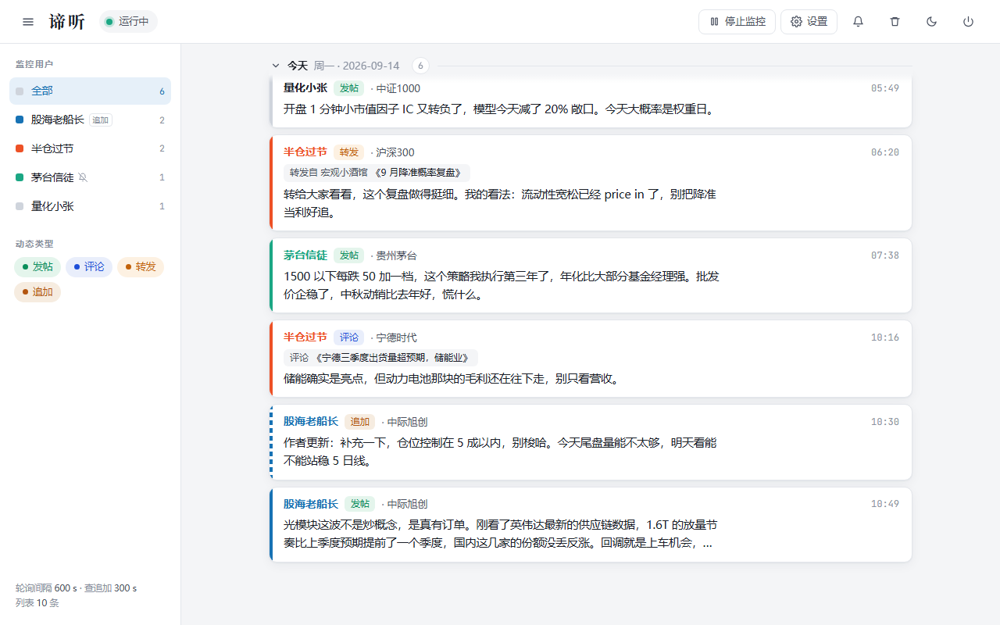

# 谛听 · 股吧动态实时盯盘助手（东方财富股吧监控）


> **谛听**，四大菩萨之一地藏菩萨之坐骑，能通晓百态，善听世间天地万物之声。  
> 本项目以此命名，专为 A 股投资盯盘打造：**本地运行、毫秒级响应、零外部构建、无第三方推送额度限制**。

「谛听」是一个运行在本机的东方财富股吧（支持可选推特 X 与微博扩展）实时监控与高频盯盘工具。监控指定大V与游资的**发帖、文章、转发、跟帖评论及 24 小时追加内容**；一旦产生新动态，立即触发 **Windows 系统通知**、**清脆盯盘提示音**与**网页看板流式更新**。

界面采用内置微型服务（`127.0.0.1:17777`），双击启动自动打开浏览器，特别针对**交易时间多屏协作、副屏/竖屏盯盘**进行了深度排版与交互优化。



---

## ✨ 核心功能特性

### 1. 极速看盘与高密度排版
- **紧凑单行模式（Dense Mode）**：顶栏快捷键一键切换，单行高度仅 28~32px，**信息密度提升 300%**，竖屏一屏尽收 20+ 条动态。鼠标悬停即出浮动摘要 Tooltip，点击就地平滑展开正文与原帖。
- **卡片视图（Card Mode）**：图文分明的高可读性卡片流，直观呈现博主、类型药丸徽标、所属股吧、发布时间、上下文引文及全文。
- **股票行情联动**：正文中的 `$股票名(代码)$`（如 `$中文在线(300364)$`）及所属股吧名称自动转换为**看盘红**行情直达链接，一键跳转东方财富实时分时/K线盘口；卡片展开区配备「行情 ↗」快捷入口。
- **“上次看到这里”未读断点分界线**：离开工位切出页面，归来时在切走处自动插入醒目的 `🔴 上次看到这里（HH:MM）` 断点分界线，新旧动态分明，滚动浏览或一键清除。
- **盯盘清脆声音提醒（Audio Ding）**：基于纯原生 **Web Audio API** 实时高频合成正弦波双音（880Hz~1760Hz 空灵衰减），**零外部音频资源依赖**；智能感知前后台状态，**仅在页面处于非激活后台或锁屏时播报提醒**，前台看盘时静默不扰。

### 2. 深度检索与本地数据沉淀
- **正文全局搜索 & 全库历史回溯（Deep Search）**：
  - 快捷键 `/` 瞬时聚焦，`Esc` 退出清空，输入关键字防抖实时高亮（`<mark>`）。
  - 支持**两级检索**：第一级瞬时过滤当前加载条目；第二级一键穿透检索本地 SQLite 全库历史，无论是搜概念、抓标的还是回溯博主历史观点，均在毫秒间呈现。
- **本地 SQLite 永久持久化**：所有捕获的历史动态自动写入本地 SQLite（`messages.db`），重启不丢数据；向上滚动流式无限分页翻阅更早历史记录。

### 3. 全场景监控与深度追踪
- **股吧全场景覆盖**：实时捕获监控用户的发帖、财富号长文、转发内容以及在他人帖子下的评论回复（自动标注「评论于谁的哪个帖子」）。
- **24 小时帖子追加内容追踪**：针对重点博主开启「🔗查追加」，自动追踪发帖后 24 小时内作者的"追加更新"（`post_add_list`），查到新追加即刻当新动态提醒并顺延追踪窗口；内置反爬验证感知与指数退避机制。
- **推特(X) & 微博支持（可选）**：核心层已标准化统一数据结构，按需开启支持跨平台多源混排。

### 4. 零摩擦配置与优雅交互
- **Web 端全功能配置管理闭环**：告别文本编辑器手动修改配置。在右侧「设置」抽屉中：
  - **在线添加用户**：输入 UID 即可一键「获取昵称」（调用东财接口探测 UID 真实性并回显真实昵称），支持直接预设备注、色彩、静音与追加；
  - **在线用户管理**：支持直接修改备注名、一键点选 8 款中国传统色、独立切换静音、独立开启查追加、删除用户（二次确认）；
  - **运行参数热生效**：在线调整轮询间隔与查追加频率，原子写回 `config.json` 并实时热更新，无需重启服务。
- **中国传统色体系**：内置 8 款中国传统高雅配色（朱红、橘橙、土黄、竹绿、翠蓝、群青、青莲、品红），支持按博主分配色彩或按类型区分，美观清爽。
- **深色模式与响应式自适应**：支持跟随系统、手动浅色、手动深色切换；针对竖屏窄窗口自适应折叠侧边栏（窄轨模式），完美贴合多屏看盘布局。
- **多渠道提醒矩阵**：Windows 10/11 系统原生通知（Toast） + 网页端实时角标（`↓ N 条新动态`） + 底部跟随滚动 + 浏览器标签页标题实时未读数 + 可选推送到微信（Server酱 / PushPlus）。

---

## ⌨️ 快捷键与操作速查

| 快捷键 / 按钮 | 触发操作 | 功能描述 |
| :--- | :--- | :--- |
| **`/`** | 聚焦搜索框 | 立即定位到顶栏搜索框开始检索关键词 |
| **`Esc`** | 清除搜索 | 清空当前搜索输入并恢复完整动态列表 |
| **`Enter` / `Space`** | 切换卡片展开 | 在卡片获得焦点时，就地展开/折叠正文详情 |
| **`≡` / `⊞`** | 紧凑 / 卡片视图切换 | 切换高密度单行看盘模式与舒适卡片模式（持久化保存） |
| **`🔊` / `🔇`** | 声音提示开关 | 开启/关闭新动态到达时的清脆声音提醒 |
| **`◀` / `▶`** | 侧边栏折叠/展开 | 切换左侧博主与类型筛选栏的宽栏与 56px 窄轨模式 |
| **`☀` / `🌙` / `💻`** | 主题切换 | 在浅色模式、深色模式、跟随系统设置间循环切换 |

---

## 🚀 快速上手

### 1. 环境准备

- 操作系统：Windows 10 / 11
- Python 版本：**Python 3.9+**
- 浏览器：任意现代浏览器（Chrome、Edge、Firefox 等）

克隆代码并安装依赖：
```bash
git clone https://github.com/Havadking/diting.git
cd diting
pip install -r requirements.txt
```
> `requirements.txt` 中仅包含可选的系统级通知库 `winotify`；未安装时程序仍可完整运行，仅系统级弹窗退化为页面内部提醒。

### 2. 启动运行

#### 方式 A：网页版（默认推荐 ⭐ 体验最佳）

双击项目根目录下的 **`run_gui.bat`**，或在命令行中运行：
```bash
python server.py
```
程序将在本地启动服务并自动调用默认浏览器打开看板（`http://127.0.0.1:17777`）。

- **离线免配置体验（Demo 模式）**：
  若想在不联网、未配置真实 UID 的情况下体验界面的完整交互与流式排版，可运行：
  ```bash
  python server.py --mock
  ```
  该模式将载入内置仿真演示数据，并以可配置的时间间隔随机模拟新动态推送。

- **更多启动参数**：
  - `python server.py --no-browser`：启动本地服务但不自动调起浏览器（用于开发或指定独立客户端）。
  - `python server.py --port 18888`：指定监听端口（默认 17777，被占用时自动递增顺延）。
  - `python server.py --host 0.0.0.0`（或双击 `run_gui_lan.bat`）：开放局域网访问，把闲置平板/手机当作专用小副屏——启动窗口会打印 `http://192.168.x.x:17777` 之类的地址（有多个时选和路由器同网段的那个），服务在后台运行，看完地址窗口可以直接关；平板浏览器打开后，iPad 用 Safari「添加到主屏幕」会以无地址栏的独立窗口打开；Android Chrome 因为局域网 http 不算安全上下文，「添加到主屏幕」只是书签，可在 `chrome://flags/#unsafely-treat-insecure-origin-as-secure` 里填入该地址后再安装，或者直接用页面右上角（窄屏在 ⋯ 菜单里）的「全屏」按钮。首次会弹 Windows 防火墙提示，勾选允许；网络类型为“公用”时可能被拦，改成“专用”。

#### 方式 B：命令行微信推送版（离席备选）

若需要在离开电脑时通过微信接收推送，先在 `config.json` 中配置 Server酱或 PushPlus 的密钥，然后运行：
```bash
python monitor.py      # 或双击 run.bat
```

#### 抓取自检测试
```bash
python test_once.py
```
快速向东财接口发送探测请求并输出配置列表中第一个用户的最新几条动态，用于验证网络连通性。

---

## ⚙️ 监控配置与用户管理

系统支持 **Web 端界面可视化配置** 与 **本地 `config.json` 文件配置** 两种方式，两者数据双向同步。

### 方式 1：Web 界面管理（推荐，全闭环操作）

1. 打开网页后，点击顶栏右上角 **「设置」** 按钮展开配置抽屉；
2. **添加监控用户**：
   - 在输入框填入目标用户的 **UID**；
   - 点击 **「获取昵称」** 按钮，后端将自动探测该 UID 是否合法，并自动带出该用户的东财真实昵称；
   - 根据需要调整备注名、勾选是否静音或开启查追加，点击 **「确定添加」** 即可实时生效；
3. **管理已有用户**：
   - 点击用户名文本可进行**就地重命名编辑**；
   - 点击 8 款色块直接分配专属标识色（同一颜色自动归为同组）；
   - 切换 **「🔕静音」** 开关（开启后该用户动态只入库入列表，不弹系统通知）；
   - 切换 **「🔗查追加」** 开关（开启后 24 小时内追踪发帖更新）；
   - 点击 **「🗑」** 按钮删除不再关注的用户；
4. **调整运行频率**：
   - 抽屉底部可直接修改**股吧轮询间隔**（秒）与**追加检查间隔**（秒）；
   - 点击 **「保存设置」**，配置将安全原子写回 `config.json` 并广播生效。

### 方式 2：配置文件手动配置

首次启动前，也可将 `config.example.json` 复制并重命名为 `config.json` 进行批量编辑：

```json
{
  "poll_interval_seconds": 60,
  "append_check_interval_seconds": 300,
  "monitor_posts": true,
  "monitor_replies": true,
  "push": {
    "type": "serverchan",
    "key": "你的_Server酱_SendKey_或_PushPlus_token"
  },
  "groups": {
    "核心大V": "#ED5126",
    "行业研报": "#25855A"
  },
  "users": [
    { 
      "uid": "5591057086910116", 
      "name": "张三", 
      "group": "核心大V",
      "check_appends": true 
    },
    { 
      "uid": "1234567890123456", 
      "name": "李四", 
      "mute": true 
    }
  ]
}
```

#### 如何获取东方财富股吧用户的 UID？
1. 在浏览器中打开 [东方财富股吧](https://guba.eastmoney.com/)，进入你要关注的用户个人主页；
2. 观察浏览器地址栏 URL，格式形如：`https://i.eastmoney.com/5591057086910116`；
3. 其中的数字串 **`5591057086910116`** 即为该用户的唯一 UID。

---

## 🔍 核心技术亮点与设计原理

```
                           ┌─────────────────────────────────────────┐
                           │      东方财富股吧 Web / 移动端 API       │
                           └────────────────────┬────────────────────┘
                                                │ (轮询抓取 / 退避策略)
                                                ▼
┌─────────────────────────────────────────────────────────────────────────────────────────┐
│ 后端核心 (core.py - MonitorCore)                                                         │
│                                                                                         │
│  ┌──────────────────────┐   首轮基线种子    ┌──────────────────────┐  写入 (线程独占)     │
│  │   后台多源轮询线程    │ ───────────────> │  内存列表 (MAX_ROWS) │ ──────────────┐   │
│  │  (去重/退避/追加监控) │                  └──────────┬───────────┘               │   │
│  └──────────┬───────────┘                             │                            ▼   │
│             │ 广播新事件                               │ 快照 / 游标翻页    ┌─────────────┐│
│             ▼                                         ▼                   │ messages.db ││
│  ┌──────────────────────┐                  ┌──────────────────────┐       │  (SQLite)   ││
│  │   事件发布与订阅队列  │ ───────────────> │  HTTP / SSE Handler  │ <─────┤             ││
│  │ (Queue per SSE conn) │  SSE 实时推送    │ (ThreadingHTTPServer)│ 全库检索└─────────────┘│
│  └──────────────────────┘                  └──────────┬───────────┘                    │
└───────────────────────────────────────────────────────┼────────────────────────────────┘
                                                        │ 本地回环 http://127.0.0.1:17777
                                                        ▼
┌─────────────────────────────────────────────────────────────────────────────────────────┐
│ 前端页面 (web/ - React 18 + htm，零构建、纯本地 Vendor)                                   │
│                                                                                         │
│  ├─ 模式流切换：卡片模式 / 紧凑单行模式（Dense Mode）                                      │
│  ├─ 交互与动效：快捷键 / 聚焦、正文高亮、未读断点分界线、悬停 Tooltip                       │
│  ├─ 音效与通知：Web Audio API 实时正弦波合成（后台防扰）、Winotify 系统 Toast             │
│  ├─ 行情联动：自动提取 $股票(代码)$ 与股吧名映射，看盘红高亮直达分时/K线盘口               │
│  └─ 离线自治：状态本地存储 (localStorage)、全库深度检索穿透、在线增删改用户与参数管理     │
└─────────────────────────────────────────────────────────────────────────────────────────┘
```

### 1. 极致轻量与零构建设计
前端坚持**零构建工具链（No Webpack / Vite / Babel Node.js runtime）**，使用仅 700 字节的 `htm` 标签模板函数配合纯正 React 18 UMD 库，所有依赖（包括字体子集）全部本地 vendor 化，彻底杜绝外网 CDN 故障隐患与版本漂移，断网依然秒开。

### 2. 首轮基线语义与启动防刷屏
每个监控来源初次拉取成功时，系统将已有历史条目平滑载入列表作为基线，**严格不触发弹窗通知与声音**，仅当后续轮询产生真正的新发帖/新回复时才发出提醒，避免启动时产生大量通知轰炸。

### 3. 24 小时帖子追加追踪与指数退避
大V发布的重要研报或长帖常在盘中多次进行「作者追加更新」。系统通过反解帖子链接请求详情页内嵌 JSON（`post_add_list`）进行精准捕获。针对东财详情页的风控特征，内置失败退避调度器：遇到频控验证页自动按 $T = \text{base} \times 2^{\text{streak}}$ 动态拉长检查间隔（封顶 2 小时），并在恢复正常后自动复原，兼顾追踪时效与接口安全性。

### 4. 股票代码与行情穿透解析
系统内置主流市场股票字典映射，并能动态扫描抓取条目中出现的股票标签（正则解析 `$标的名称(6位代码)$`）及股吧名称。条目渲染时动态构建正规化映射字典，自动为所有相关标的挂载看盘红行情直通车超链接，大幅缩短看盘决策链路。

---

## 📂 项目结构说明

```
guba-monitor/
├── server.py              # 网页版入口：纯标准库 HTTP 服务 + API 路由 + SSE 长连接分发
├── core.py                # 监控调度核心：多源轮询、首轮基线、去重、追加监视、SQLite 存取
├── monitor.py             # 数据抓取与解析层：东财/推特/微博接口解析、SQLite 底层封装
├── mock_data.py           # 离线演练仿真引擎：Demo 模式模拟数据与 MockCore
├── test_once.py           # 接口连通性快速单次自检测试脚本
├── app.py                 # 旧版 tkinter 桌面客户端（过渡保留）
├── run_gui.bat            # 快捷启动脚本（双击启动网页版看板）
├── run_gui_tk.bat         # 快捷启动脚本（旧版桌面客户端）
├── run.bat                # 快捷启动脚本（命令行推送版）
├── config.example.json    # 配置文件模板
├── requirements.txt       # 依赖声明（可选 winotify / sv_ttk）
├── docs/                  # 设计与技术文档
│   ├── screenshot.png     # 界面效果预览图
│   ├── web-design.md      # 网页版架构与接口演进设计文档
│   └── v2-design.md       # v2.0 紧凑排版、检索与音效进阶设计文档
└── web/                   # 网页端前端静态资源（纯静态、零构建）
    ├── index.html         # 单页应用 HTML 骨架
    ├── app.css            # 完整样式表（紧凑模式、深浅主题 token、响应式布局）
    ├── app.js             # React 18 + htm 单文件前端交互核心
    ├── favicon.svg        # 「谛听」神兽灵耳辨音矢量图标
    ├── favicon.ico        # 网页图标 ICO
    └── vendor/            # 本地第三方库与字体子集（零外网依赖）
        ├── react.production.min.js
        ├── react-dom.production.min.js
        ├── htm.min.js
        ├── diting-serif.woff2
        └── jetbrains-mono.woff2
```

---

## 📡 RESTful API 契约速查

本机 HTTP 服务监听在 `127.0.0.1:17777`，所有 `POST` 操作均带有严格的 `Origin` 回环防护校验：

| 接口 | 方法 | 请求参数 / Payload | 功能描述 |
| :--- | :--- | :--- | :--- |
| `/api/snapshot` | `GET` | `limit=300` | 获取首屏快照（包含最新动态列表、运行状态、监控用户列表等） |
| `/api/events` | `GET` | - | SSE (Server-Sent Events) 长连接通道，实时接收 `new`/`status`/`config` 事件 |
| `/api/items` | `GET` | `before=<time>&before_key=<key>&limit=50` | 游标式向更早翻页查询历史数据（由 `messages.db` 提供支持） |
| `/api/search` | `GET` | `q=<keyword>&limit=100` | 全库历史深度检索，穿透查询 SQLite 中的所有正文、所属股吧与作者 |
| `/api/probe_user` | `GET` | `uid=<uid>` | 探测股吧 UID 合法性并实时返回其东财昵称，用于辅助添加配置 |
| `/api/users/manage` | `POST` | `action="add"\|"delete"\|"update_all"`, 相应 payload | 在线增删用户、修改备注及热调轮询频率，安全原子写回 `config.json` |
| `/api/users` | `POST` | `{"users": [{"uid": "...", "color": "...", ...}]}` | 批量更新用户配色、静音及查追加状态 |
| `/api/control` | `POST` | `action="start"\|"stop"\|"clear"\|"test_toast"\|"quit"` | 控制监控启停、清空当前列表、测试系统通知、安全退出进程 |

---

## 💡 常见问题排查 (FAQ)

### 1. Windows 系统通知没有弹出来？
- **系统通知总开关**：进入 Windows「设置 → 系统 → 通知」，确保通知开关已处于「开启」状态；
- **排查勿扰 / 专注助手**：如果系统开启了「专注助手（Focus Assist）」或「勿扰模式」，系统通知会被后台自动拦截收纳进操作中心而不弹出横幅，请将其设为关闭；
- **验证通知通道**：点击网页看板顶栏的 **「🔔 测试通知」** 按钮，若能弹出提示即表明配置完全正常。

### 2. 盯盘声音提醒（Audio Ding）为什么没有响？
- **浏览器自动播放安全策略**：现代浏览器出于防骚扰考虑，要求用户必须在当前页面上有过**至少一次点击或按键交互**后，才允许网页合成/播放声音。打开页面后任意点击一次即可解锁；
- **智能后台防扰机制**：声音提醒默认采用了防扰设计——**仅当网页处于非激活后台标签页或屏幕锁定时**，来新消息才会响铃；如果您正注视着当前页面，新动态将直接静默流式刷出。

### 3. 抓取会不会导致账号或 IP 被限流？
- 股吧公开动态接口不需要登录 Cookie，且程序内部在各用户抓取间隙注入了随机微休眠，默认 30~60 秒的轮询间隔对服务器负载极低，正常使用无风险；
- 请勿将轮询间隔设置得过于激进（例如小于 10 秒），避免触发接口防护。

---

## ⚠️ 免责声明

1. 本项目仅供**个人学习交流与投资辅助自用**。请合理配置抓取频率，自觉遵守相关数据平台的服务协议。
2. 数据接口来源于第三方网站的公开通道，可能因接口调整或网络原因出现波动或失效，作者不对由于使用本工具造成的任何直接或间接后果承担责任。

---

## 📄 开源许可证

本项目基于 [MIT License](LICENSE) 开源发布。
